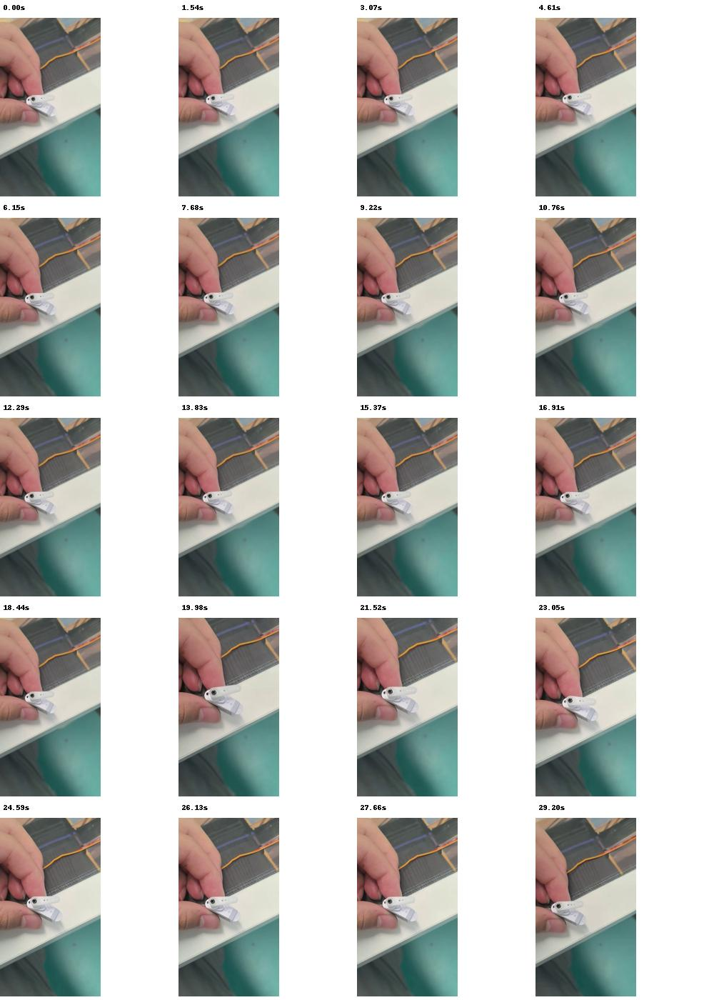
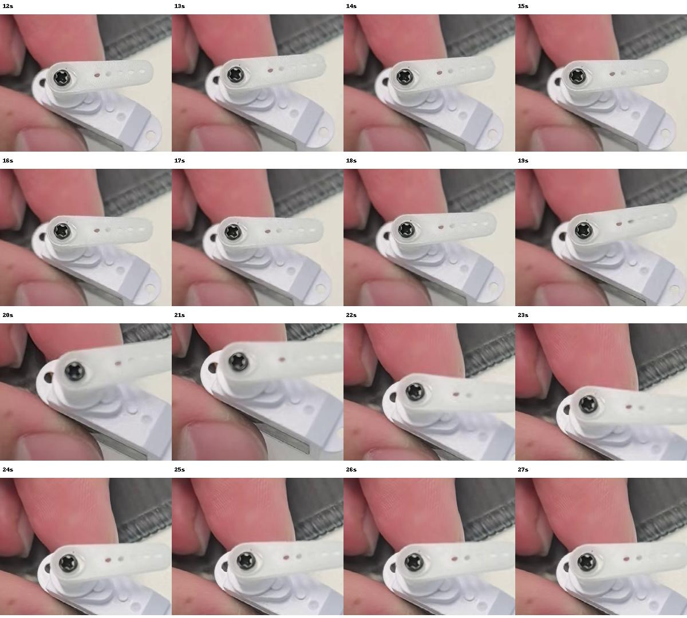
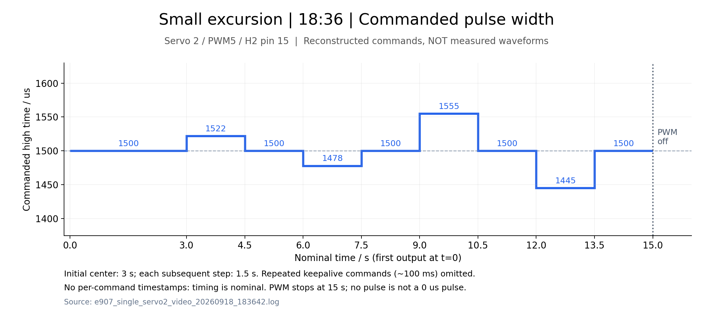
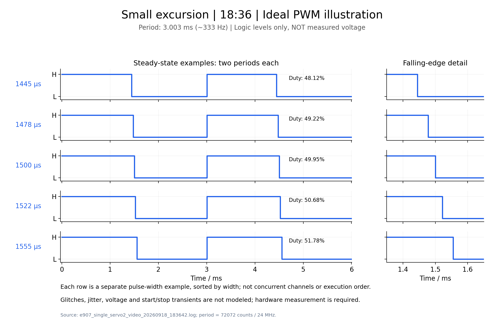
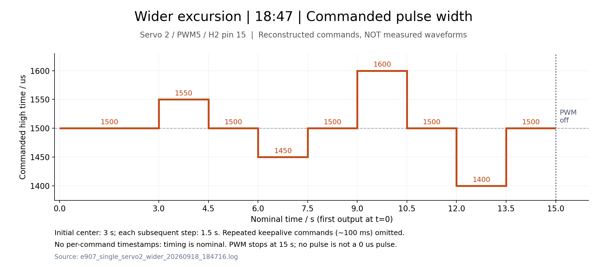
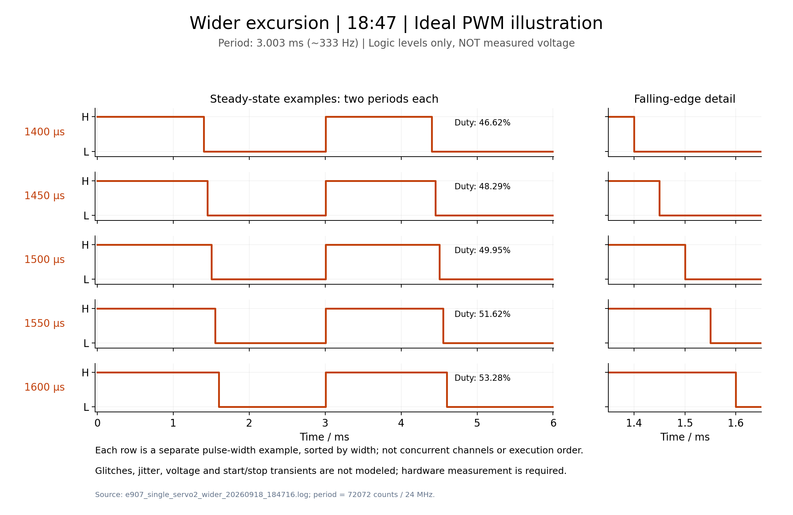

# MaixCAM2 E907 四舵机测试总结 — 2026-09-18

## 1. 当日结论与证据范围

本次为**独立舵机台架测试**，没有接入视觉识别或其他项目的控制逻辑。MaixCAM2 大核运行 Linux 加载器，通过共享内存发送测试指令；E907 小核配置 PWM4–7，并执行约 1 秒指令超时停机。

截至本次整理，已完成以下工作：

| 项目 | 结果 | 结论边界 |
|---|---|---|
| E907 临时 RAM 启动与共享内存应答 | 实机 100/100 次通过 | 不涉及舵机动作 |
| 四路 PWM 寄存器、独立目标、参数拒绝、单路选择 | 未接舵机实机验证通过 | 未用示波器测量引脚波形 |
| 约 1 秒目标超时、SIGTERM 清理 | 实机通过 | 不是独立硬件故障保护 |
| 2 号舵机小幅单轮测试及录像复测 | 两次指令与寄存器检查通过 | 录像可见小幅机械响应，不构成角度精度验收 |
| 2 号舵机增幅单轮测试 | 指令与寄存器检查通过 | 未提供增幅测试录像或精确角度测量 |
| 2 号舵机固定 1600μs 输出 | 已启动，观察约 5 秒后进程仍在运行 | 没有长期稳定性或该次最终停止过程的完整记录 |
| 四个已连接舵机依次测试 | 一轮、36 步检查通过，正常恢复 | 四个舵机的机械动作仍需现场确认 |
| 四路同时往返模式 | 代码完成，本地测试通过，已上传 | **尚无四路同时转动的实机运行结果** |
| 图像资料 | 已生成录像抽帧及两组波形图 | 波形图是指令/标称时序重建，非示波器实测 |

本报告按当日会话与文件记录整理。下文时间取日志文件名，用于定位记录；部分历史板端时间与主机日期不一致，例如预检 JSON 内 `utc` 为 9 月 14 日，不能将其当作本次统一时间基准。日志未记录每条动作的准确时间戳，15 秒、60 秒均为程序标称时长。

## 2. 硬件、供电与接线

- 核心板：MaixCAM2；载板：自研 V1。
- 已连接设备：`maixcam2-75c4`；系统镜像：`maixcam2-2026-05-29-maixpy-v4.12.5`；内核：`4.19.125`。
- 舵机：用户提供的 PTK 产品图片，标注刷新率 333Hz、脉宽 500–2500μs、中位 1500μs、工作电压 4.8–7.4V、标称行程约 180°。
- 本次测试限幅：1400–1600μs，不进行端点或全行程扫描。
- 用户确认单舵机信号接 **H2 第 15 脚**，红线对应 **7.4V（用户描述，非独立实测）**；插头处实际带载电压仍待测，上游是否经过 BEC 及其稳压能力未核实。不能直接按稳定 7.4V 校准；本次没有仪表测量电压、电流。
- 后续用户确认四个舵机均已接入，再执行四路依次测试。

### 2.1 V1 信号映射

| 软件编号 | SoC 引脚 | PWM 通道 | 核心板 J2 | H2 信号脚 | H2 正极 | H2 回流 |
|---|---|---|---|---|---|---|
| 1 | B2 | PWM4 | 20 | 12 | 11 | 10 |
| 2 | B3 | PWM5 | 22 | 15 | 14 | 13 |
| 3 | A30 | PWM6 | 8 | 9 | 8 | 7 |
| 4 | A31 | PWM7 | 6 | 6 | 5 | 4 |

四组舵机正极在 V1 原理图中接 **VBATT，不是稳压 5V**；回流经 Q3（CJ3400）接地，Q3 栅极接 5V。H2 第 2 脚的 5V 属于另一组网络，不能把五组插针都视为舵机 PWM 接口。照片的位置必须结合引脚编号确认，不能只按左右顺序推断。

原理图核对详见 [早期检查报告](review_2026-09-18.md)。原 PDF 位于仓库外 `../PDF_2026-09-09/SCH_载板V1_2026-09-09.pdf`（相对仓库根目录）；本报告不依赖该外部文件才能查看上述映射。用户在聊天中提供的产品规格图和接线照片未找到独立本地图片文件，故未伪造其附件链接。

## 3. 软件实现与当日改动

### 3.1 从标准 RTT 检查转向独立 RAM 加载

早期只读预检显示系统未启用 `CONFIG_AX_RISCV_SUPPORT`，没有绑定的 `ax_riscv` 设备。这个结论仅说明原有标准 RTT 路径不能直接运行，**不代表 E907 无法启动**。

查阅并保存官方 SDK 启动、PWM、timer64 与 CMM 接口资料后，采用新的开发验证路径：

1. 检查 E907 位于预期复位状态、时钟关闭、旧启动地址为 0。
2. 检查 Linux PWM1 无占用，保存寄存器、pad 与时钟状态，临时解绑 `6061000.pwm1`。
3. 通过 `AX_SYS_MemAlloc` 申请 16KiB CMM 内存，不使用可能与 Linux RAM 冲突的固定地址。
4. 程序放首个 4KiB，共享页位于偏移 `0x1000`，栈顶位于 `0x4000`。
5. 按官方 BL1 启动顺序启动 E907；A53 通过共享内存发命令，E907 写 PWM 寄存器。
6. 每条目标命令检查应答、active mask 和 PWM 值，并由 A53 独立读取硬件寄存器复核。
7. 退出时复位 E907，恢复 PWM、引脚和时钟，重新绑定 Linux 驱动并释放 CMM 内存。

这是一套**实验性裸机 RAM 加载器**，不是官方现成 Linux 加载工具，也不是原 RT-Thread 工程已经实机运行。没有刷写启动分区或修改内核。官方资料索引与实现细节见 [E907 README](../firmware/e907_live/README.md#官方依据与实现边界)。

### 3.2 代码和功能

| 文件 | 作用及本轮改动 |
|---|---|
| [tools/e907_live_probe.c](../tools/e907_live_probe.c) | A53 加载器；加入单路/四路依次、循环、固定保持、四路同时模式；输出读回检查及退出恢复 |
| [tools/e907_bench_sequence.h](../tools/e907_bench_sequence.h) | 固定动作序列、1–10000 次循环、约 100ms 保活、分组或逐路执行 |
| [firmware/e907_live/servo.c](../firmware/e907_live/servo.c) | E907 共享内存服务；四路 PWM、1400–1600μs 参数检查和约 1 秒断流停机 |
| [firmware/e907_live/start.S](../firmware/e907_live/start.S)、[probe.S](../firmware/e907_live/probe.S) | 小核启动入口、异常记录及无 PWM 应答探针 |
| [tools/build_e907_live.sh](../tools/build_e907_live.sh) | RV32 固件及 AArch64 加载器构建 |
| [cpp/tests/e907_bench_test.c](../cpp/tests/e907_bench_test.c) | 动作持续时间、保活、通道选择、循环、分组更新、错误及取消测试 |
| [tools/plot_e907_tests.py](../tools/plot_e907_tests.py) | 从两次日志重建脉宽时序及理想 PWM 图 |
| [BENCH.md](../firmware/e907_live/BENCH.md) | 接线、上传、测试模式、停止方法及实现边界 |

早期还清理了 `Zone.Identifier` 附件元数据，并补充 `.gitignore` 排除编译产物、缓存等；改进了 [RTT 分支 servo_bench.c](../firmware/servo_bench.c) 的单路选择、资源与错误检查，以及 [PWM 微秒扩展](../firmware/pwm_us_extension.c.inc) 的参数校验和重复目标处理。**本日后续带舵机测试实际使用的是 `firmware/e907_live/` 与 A53 加载器，不是 RTT shell 命令。**

## 4. 实际测试流程与结果

### 4.1 无舵机：启动、寄存器与停机机制

- [E907 探针日志](e907_live_probe_2026-09-18.log)：100 次共享内存应答通过，未访问 PWM/UART。
- [最终四路寄存器日志](e907_live_servo_final_2026-09-18.log)：四路相同目标及四个不同目标读回通过；拒绝非法 mask、1399μs 和 1601μs；显式停止、单路启用检查通过。
- 停止发送目标后，主机观测停机等待 **999.937ms**，`trips=1`、`active_mask=0`。这不是示波器测得的脉冲停止时刻。
- [SIGTERM 清理日志](e907_signal_cleanup_final_2026-09-18.log)：PWM 启用期间发停止信号，验证驱动重新绑定、CMM 释放及恢复。被中断的测试程序退出码为 1，外层验证脚本确认清理通过并以 0 退出，不能混淆这两个退出码。

### 4.2 单舵机小幅动作与录像复测

用户确认 2 号舵机接 H2 第 15 脚后，运行：

```sh
./e907_live_probe --bench-servo 2 ./e907_servo.bin --cycles 1
```

当时的动作序列为：

```text
1500 → 1522 → 1500 → 1478 → 1500 → 1555 → 1500 → 1445 → 1500 μs
```

初始 1500μs 保持 3 秒，其后每步 1.5 秒，每轮约 15 秒。按产品标称脉宽/行程线性估算，约为中心 ±2°、±5°；这是理论值，不是实测角度。

| 记录 | 结果 |
|---|---|
| [18:34 首次单轮](e907_single_servo2_20260918_183456.log) | 9 步及寄存器检查通过；退出码 0；资源恢复 |
| [18:36 录像复测](e907_single_servo2_video_20260918_183642.log) | 再次完成 9 步；退出码 0；资源恢复 |

### 4.3 增大幅度后的单舵机测试

修改动作序列，并重新编译、上传和校验加载器：

```text
1500 → 1550 → 1500 → 1450 → 1500 → 1600 → 1500 → 1400 → 1500 μs
```

频率保持 333Hz，理论偏转增至约 ±4.5°、±9°，每轮仍约 15 秒。程序参数检查仍限制在 1400–1600μs，没有扩大到舵机全部标称范围。

[18:47 增幅单轮日志](e907_single_servo2_wider_20260918_184716.log)记录：9 步目标通过，`EXIT_STATUS 0`，四路测试输出关闭，E907 及 PWM1 状态恢复。本次没有提供增幅动作的录像，不能把前面的录像当作增幅效果证据。

### 4.4 固定位置持续输出

根据用户选择，增加并启动：

```sh
./e907_live_probe --hold-servo 2 ./e907_servo.bin
```

固定 **333Hz、1600μs**，没有周期性往返；每约 100ms 发送相同目标维持租期。后台启动后 SSH 断开仍继续输出。

[19:13 固定输出记录](e907_servo2_hold_20260918_191309.log)包含上传 SHA256、E907 启动、1600μs 输出验证以及进程状态；启动后观察约 5 秒，进程仍在运行。后续四路测试前已查不到该进程，板端临时目录也已消失；没有足够证据确定消失原因或具体停止时刻，不能声称这一轮执行过完整的手动停止验证。

### 4.5 四个已连接舵机依次测试

用户接上四个舵机后，运行：

```sh
./e907_live_probe --bench-servo all ./e907_servo.bin --cycles 1
```

过程包含一次失败及一次成功：

| 记录 | 结果与处理 |
|---|---|
| [19:30 首次尝试](e907_four_servos_20260918_193048.log) | `/tmp/e907_bench` 不存在，命令退出码 1；本次未启动测试输出 |
| [19:32 重新上传后测试](e907_four_servos_20260918_193218.log) | 上传文件并校验后，1→2→3→4 依次执行，每路 9 步，共 36 步；退出码 0，PWM1 驱动恢复 |

每次只启用一路，其余三路禁用；每路约 15 秒，总计约 60 秒。日志证明控制命令及硬件寄存器符合预期，**尚未收到四个舵机机械动作均正常的明确现场反馈或录像**。

### 4.6 四路同时模式的开发与部署

新增命令：

```sh
./e907_live_probe --bench-together all ./e907_servo.bin --cycles 1
```

每步将相同脉宽写入四路目标，以一条 `mask=0xF` 命令提交；四路同时保持输出，动作序列与增幅版相同。一轮约 15 秒，三轮约 45 秒。

实现已编译、本地测试通过，并上传到板端；上传后校验文件与命令行帮助，**没有启动四路同时动作**。共享内存同一命令提交不等于硬件同步锁存：小核仍顺序写 PWM 寄存器，四路电气边沿和机械响应不保证严格同步。

当日最终上传文件 SHA256（会话上传结果与整理时本地产物一致）：

```text
e907_live_probe
ba6b5172ca8928995a32bc416059dbb797ffefeb9f40c410f496857b6fcdf0f7

e907_servo.bin
952c5a95b44819a5cf0e5f34f248ace7000e44fb62c2e9e62bbe0633ef3563ac
```

## 5. 录像与图片

### 5.1 小幅测试原始录像

[打开原始 MP4](../videos/437f0f3a222445521bf7e652896ffd0a.mp4)，约 29.327 秒，720×1280、30fps。

抽帧可以观察到舵盘相对外壳的小幅位置变化，与小幅往返的预期相符。不过存在手持移动、相机透视及局部模糊，没有固定角度标尺和命令时间同步，不能精确判断回中误差、实际转角、响应时间或细微抖动。视频时间是录像起点，不等于测试命令的 t=0。

全程抽帧：



12–27 秒局部放大抽帧：



### 5.2 小幅测试：目标脉宽时序

对应 [18:36 日志](e907_single_servo2_video_20260918_183642.log)。横轴按程序设定：3 秒初始保持，其后 1.5 秒一步；采用与增幅图相同纵轴范围，便于比较。



[下载矢量 SVG](waveforms/small_timing.svg)

### 5.3 小幅测试：理想 PWM

每行代表一个独立目标脉宽的稳定输出示例，并非五路同时输出。右侧放大下降沿位置。



[下载矢量 SVG](waveforms/small_pwm.svg)

### 5.4 增幅测试：目标脉宽时序

对应 [18:47 日志](e907_single_servo2_wider_20260918_184716.log)，范围增至 1400–1600μs。



[下载矢量 SVG](waveforms/wider_timing.svg)

### 5.5 增幅测试：理想 PWM



[下载矢量 SVG](waveforms/wider_pwm.svg)

**四张波形图均不是示波器实测。** 周期按 `72072 / 24MHz = 3.003ms` 重建，频率约 333Hz；纵轴高低仅表示逻辑状态，不表示实测电压。未绘入真实抖动、毛刺、启动/停止瞬态和通信延迟。1500μs 对应占空比约 49.95%，1400μs 与 1600μs 分别约 46.62% 和 53.28%。波形图不能用于证明引脚电气质量。

## 6. 构建与本地验证

构建入口：

```sh
export RISCV_CC=/path/to/riscv64-unknown-elf-gcc
export ARM_CC=/path/to/aarch64-none-linux-gnu-gcc
# 解包的 Debian RISC-V 工具链必要时指定：
# export RISCV_BINUTILS_DIR=/path/to/usr/lib/riscv64-unknown-elf/bin
./tools/build_e907_live.sh
```

当日使用 RV GCC 10.2.0、AArch64 GCC 11.3.0；探针镜像 148 字节，舵机镜像 1536 字节，另有 BSS 24 字节。编译启用 `-Wall -Wextra -Werror`。

本地测试命令：

```sh
cmake -S cpp -B /tmp/servo_review_build
cmake --build /tmp/servo_review_build -j4
ctest --test-dir /tmp/servo_review_build --output-on-failure
```

早期 [保存的主机测试日志](host_tests_2026-09-18.txt)是 **3/3**。新增动作序列测试后，会话内多次运行最新测试为 **4/4**：`core`、`firmware_simulation`、`pwm_extension_simulation`、`e907_bench_simulation`。不要把旧文件误读为四项测试的原始记录。

新增模拟覆盖：通道选择、单轮与多轮持续时间、保活间隔、非法循环次数、错误/取消后停止，以及四路分组更新和两轮约 30 秒的行为。模拟不替代实机输出、电源或机械测试。

图表可在仓库根目录重新生成：

```sh
python3 tools/plot_e907_tests.py
```

依赖 Python、Matplotlib 和 NumPy；输出位于 `reports/waveforms/`。

## 7. 连接、部署与复现命令

### 7.1 SSH 与上传

USB 网络地址当日为 `10.11.105.1`；用户后续提供 Wi-Fi 地址 `192.168.137.18`。本次代理实际上传/实测使用 USB 地址；Wi-Fi 地址仅提供了连接方法，没有记录成功连接验证。SSH 账户为 `root`，密码不在本报告重复保存。自动连接使用已有 known_hosts 校验，没有关闭主机身份检查。

在电脑项目根目录执行（以下示例使用用户提供的 Wi-Fi 地址，电脑与板卡需网络互通）：

```sh
ssh root@192.168.137.18
```

在旧测试已退出的前提下上传：

```sh
ssh root@192.168.137.18 'mkdir -p /tmp/e907_bench'
scp build_e907_live/e907_live_probe build_e907_live/e907_servo.bin root@192.168.137.18:/tmp/e907_bench/
ssh root@192.168.137.18 'chmod +x /tmp/e907_bench/e907_live_probe'
```

USB 连接时将地址换成 `10.11.105.1`。`/tmp` 下文件可能在重启或清理后消失，需要重新上传；本次确实遇到过目录丢失，不应把它误判为 PWM 故障。

### 7.2 当前版本运行模式

以下在板端执行，每条是独立选择，不需要全部依次运行：

```sh
cd /tmp/e907_bench

# 2号舵机增幅测试：一轮约15秒
./e907_live_probe --bench-servo 2 ./e907_servo.bin --cycles 1

# 四路依次：一轮约60秒
./e907_live_probe --bench-servo all ./e907_servo.bin --cycles 1

# 四路同时：一轮约15秒（当日尚无此模式实测记录）
./e907_live_probe --bench-together all ./e907_servo.bin --cycles 1

# 四路同时：三轮约45秒
./e907_live_probe --bench-together all ./e907_servo.bin --cycles 3

# 2号固定333Hz、1600μs，持续直到停止
./e907_live_probe --hold-servo 2 ./e907_servo.bin
```

前台运行按 Ctrl+C 停止。若用本日部署方式后台运行固定保持，并保存了 `hold.pid`，确认 PID 对应加载器后停止：

```sh
kill -TERM "$(cat /tmp/e907_bench/hold.pid)"
cat /tmp/e907_bench/hold.log
```

正常结束先完成最后居中停留，再停止 PWM；手动中断直接清理，不先回中。停止 PWM 不等于切断舵机供电，也不保证舵机释放力矩。不要用 `kill -9` 跳过清理。

`--run-servo-test` 是早期未接舵机的寄存器与故障注入测试，不替代本报告的机械动作模式；RTT 的 `start/stop/status` 也不是此加载器命令。

## 8. 尚待验证与交付文件

仍需验证：

1. 四路同时动作的实机效果、四个舵机机械方向和回中一致性。
2. 四路同时动作时的电源电压变化、峰值电流与载板回流能力；逐路通过不能证明这一点。
3. 示波器/逻辑分析仪测量 H2 信号相对板卡 GND 的真实频率、高电平宽度、幅值、更新毛刺和抖动。
4. 固定机位、固定外壳和标尺条件下的转角、重复定位和响应时间。
5. 固定保持模式的长时间稳定性；当前仅有短时间存活检查。

程序通过 stop/reload/start 更新脉宽，不保证无毛刺或四路边沿严格同步。超时停机依赖 E907 循环继续执行；进程崩溃、SIGKILL 或系统故障不保证释放流程安全，CMM 内存与加载器生命周期耦合。本程序的定位是受控台架开发验证。

本报告与 `assets/2026-09-18/`、`waveforms/`、相关 `.log` 和 `../videos/` 一起构成当天的可追溯资料。分享或移动 Markdown 时需保留相对路径目录结构；仅复制 Markdown 文件不会包含图片和录像本体。


## 9. 报告后续修复：采集协议、供电及文档

- `servo_collect` 现兼容 `SERVO`、历史 `BENCH servo=...`、`BENCH mask=...` 和新 `BENCH_CMD`。历史记录时间缺失时 CSV 留空，不能追溯补出真实动作时间。
- 加载器新增 A53 单调时钟的提交前/检查后纳秒时间，以及 E907 的 24MHz、32位状态快照计数；每条保活也记录。同一四路命令在 CSV 中展开为四行，保留共同序号、mask 和时刻。详见 [日志协议](../firmware/e907_live/TELEMETRY.md)。这些不是机械动作时间，也不自动与视频对时。
- 供电统一按原理图的 VBATT 直连描述；7.4V 只是用户提供信息，实际插头电压待测，不能认定已由 BEC 稳压。
- README/BENCH 中“未做任何带舵机实测”的旧状态已更新；四路同时模式仍只确认部署，没有新增实机结果。
- 本节代码修改后需重新部署加载器才能产生带时间戳的新日志；未为了本次修复再次驱动舵机。此前日志、图片和最终上传哈希均属于历史版本，不覆盖改写。
